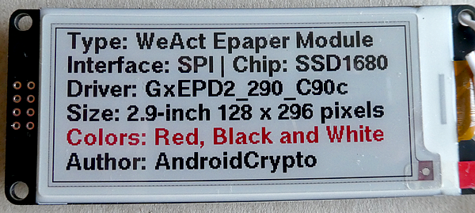

# ESP32-S3 Zero WeAct 2.9-inch Epaper Module Display-Info

This is the accompanying repository for my article "Getting Started with a 2.9-inch Epaper display connected to an ESP32-S3 Zero device" available here: 


The display comes in 2 variants, this is the "Black & White" version:


The display comes in 2 variants, this is the "Red, Black & White" version:



## Required Libraries
````plaintext
GxEPD2 by "ZinggJM" version 1.6.4 (https://github.com/ZinggJM/GxEPD2)
Adafruit-GFX-Library by "Adafruit" version 1.12.1 (https://github.com/adafruit/Adafruit-GFX-Library)
U8G2_FOR_ADAFRUIT_GFX by "olikraus" latest version (https://github.com/olikraus/u8g2/)
````

## Runtime Environment
````plaintext
Arduino 2.3.6 (Windows)
esp32 boards version 3.2.0
For compiling and uploading, I'm using the "ESP32-S3 Dev Module" board
````

## Wiring
````plaintext
Nr name  color   ESP32-S3 pin
1  BUSY  violet  43 labled as 'TX' pin 
2  RES   orange  11
3  D/C   white   12
4  CS    blue    13
5  SCL   green   44 labled as 'RX' pin
6  SDA   yellow  10 ('SDA' terminal is known as 'MOSI')
7  GND   black   GND
8  VCC   red     VCC is 3.3 volt, not 5 volt !
````
Back side of the display:


